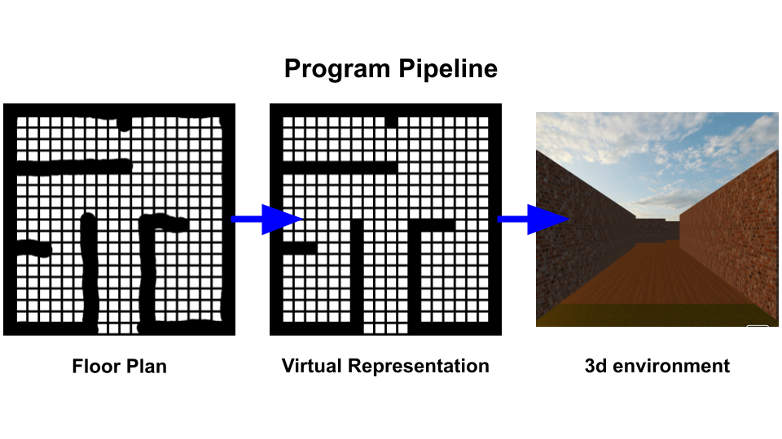
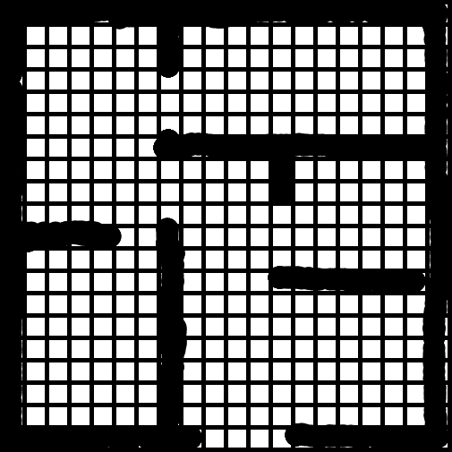
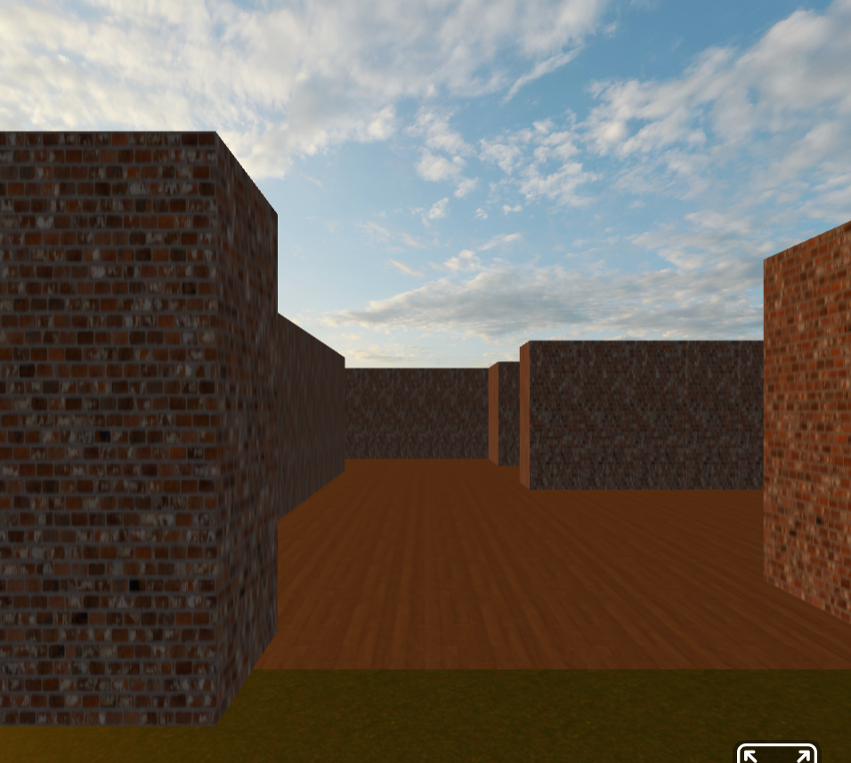

# 3d Visualization for First Responders
Familiarity is key in order to respond quickly. In first responder scenarios, a 2d map does not convey all of the spatial information that a 3d interactive simulation would. This project aims to create a more effective way for first-response personnel to quickly absorb the new environment they are about to encounter using VR technology. The idea would be for them to enter the 'virtual space' before the real deal, ensuring preparation.
>[!NOTE]
>This research project was done during a program run by the Shenandoah Valley Computer Science Regional Partnership. Currently, it is in the prototype phase. Future improvements could enable compatibility with multistory or industry-standard floor plans, and many more features.

## Overview
+ A 2d floor plan (in a grid format) is provided to [gen.py](gen.py).
+ The script generates an HTML file containing an interactive web app.
  + Its contents are [pre.txt](pre.txt) + walls of floor plan + [post.txt](post.txt).
+ The user can explore the 3d building in a MetaQuest VR headset, or another environment that supports WebXR (such as a browser).
  
  

## Demo
+ View an example 3d floor plan environment: [https://skynet172.github.io/3dVisualizationForFirstResponders/sketch1.html](https://skynet172.github.io/3dVisualizationForFirstResponders/sketch1.html)
+ WASD to move, Click and drag to look around
+ Try refreshing the page or waiting a bit if it doesn't work. Use Chrome, Firefox or Edge for best results.

## Running Locally
>[!IMPORTANT]
>Ensure that you have NumPy and OpenCV, as they are dependencies.
1. Use `git clone https://github.com/skynet172/3dVisualizationForFirstResponders` to clone the repo.
2. Use `cd 3d` to change into the project directory.
3. Open [drawing.html](drawing.html) ([demo](https://skynet172.github.io/3dVisualizationForFirstResponders/drawing.html)) in a web browser. Draw a floor plan and save the image (`Right-Click` then `Save-Image`) in the project directory.
   + Here is an example:
   
   
4. Run `python3 gen.py` or your platform's equivalent. Enter the file name of the image (file extension too). Here's a peek into what the program does:
   + Grid cells >= a 75% threshold are 'filled in' and stored in an array. Visualization:
     
   +  Then, the script generates the HTML file for the web app:
       ```
        (...)
        <a-box shadow="cast: true" src="#brick"
        normal-map="#brick_norm" scale="1.05 3
        1.05"position="-10.0 1.51 -23.0">
        </a-box>
        
        <a-box shadow="cast: true" src="#brick"
        normal-map="#brick_norm" scale="1.05 3
        1.05"position="-10.0 1.51 -21.94736842105263">
        </a-box>
        (...)
        ```
5. Open the HTML file in a web browser. Click and drag to look around. Use WASD to move.
   + To run it on a MetaQuest headset, put the program on a website, then navigate to it with the headset's browser. Enter immersive mode, and then you can see the environment as if it were in real life! Use the joystick to move.
    
   + All done!

## Credits
**A-Frame**  
VR framework based on three.js  
[https://a-frame.io](https://a-frame.io)  
[https://github.com/aframevr/aframe](https://github.com/aframevr/aframe)  
MIT license  

**oculus-thumbstick-controls**  
Script and block of code that allows for thumbstick controls
[https://github.com/gftruj/webzamples/tree/master/aframe/controls ](https://github.com/gftruj/webzamples/tree/master/aframe/controls )  
by Piotr Milewski  
MIT license  

**Poly Haven**  
[https://polyhaven.com/](https://polyhaven.com/)  
Free, CC0 texture assets  

**ambientCG**  
[https://ambientcg.com/](https://ambientcg.com/)  
Free, CC0 texture assets 

**Poliigon**  
[https://www.poliigon.com/](https://www.poliigon.com/)  
Assets used in screenshots

## Resources Used  
**Learn A-Frame (WebVR)**  
A-Frame tutorial series  
[https://www.youtube.com/playlist?list=PL8MkBHej75fJD-HveDzm4xKrciC5VfYuV ](https://www.youtube.com/playlist?list=PL8MkBHej75fJD-HveDzm4xKrciC5VfYuV )  
by Danilo Pasquariello  

**MDN Web Docs**  
[https://developer.mozilla.org/en-US/](https://developer.mozilla.org/en-US/)  
by MDN Web Docs contributors  

**OpenCV Pixel Tutorial**  
[https://www.tutorialspoint.com/how-to-access-and-modify-pixel-value-in-an-image-using-opencv-python](https://www.tutorialspoint.com/how-to-access-and-modify-pixel-value-in-an-image-using-opencv-python)  
by Shahid Khan  
